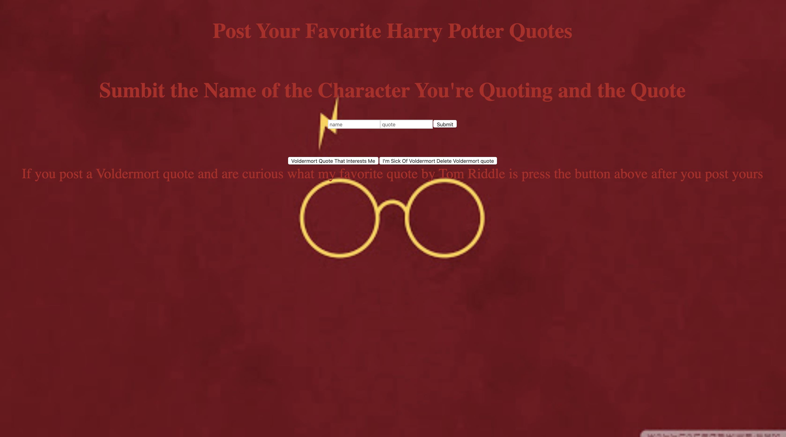

# CRUD

The task is to create an application that incorporates CRUD attributes. I went with a Harry Potter Quote page. Users can pick there favorite characters and input the quote they most liked from them.

## How It Was Made:

## Tech Used: HTML,CSS,JS, Node.JS, MongoDB

## Lessons Learned:

I have just begun my journey into the backend and am still getting familiar with the commands, syntax and general logic. It was a fun project and one that I will be hoping to build on.

## Links to Other Works:

https://github.com/zikrehaimanot/dogapi

https://github.com/zikrehaimanot/coingame

https://zikrestock.netlify.com/
